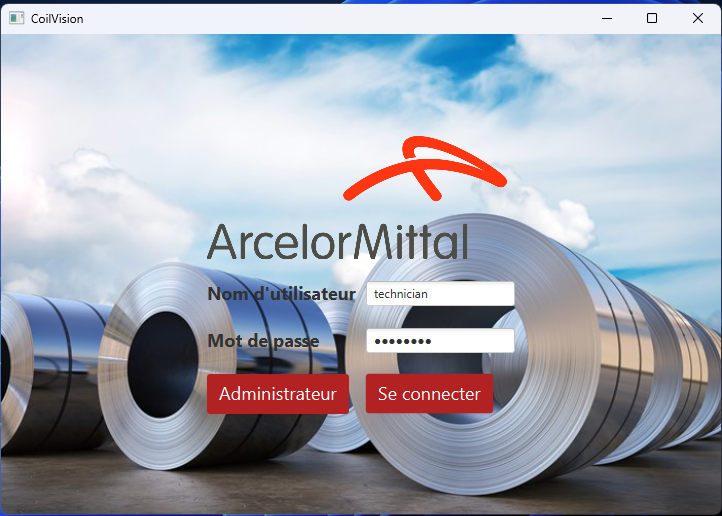

# ArcelorMittal : CoilVision 

  

## **1. About this project**

Everything is explained in our different files within the *Reports* folder. However everything is written in French. To simplify and summarize our project, feel free to read this README!

This project was done in a school context with three other classmates.

## **2. The context**

ArcelorMittal, a global leader in the steel industry, stands out as one of the world's foremost steel groups. In 2018, it claimed the position of the leading steel producer with an impressive production volume of nearly 100 million tons. Seeking to enhance production efficiency and elevate product quality, ArcelorMittal collaborates with IMT Mines Alès on the CoilVision project.

The production process culminates in a critical rolling step, where metal blocks undergo transformation into metal coils. This involves heating, resizing in width and thickness, cooling to achieve desired quality and mechanical properties, and finally, winding to obtain the desired structure.

  

Throughout this intricate process, the metal is susceptible to degradation, leading to surface imperfections. Once these imperfections manifest, the material becomes unsuitable for use and sale, resulting in discarding or classification as defective. To mitigate such degradations, it is imperative to apply the correct lubrication at the right time to prevent damage to the metal plates, ensuring quality production, material integrity, and improved yield.

The CoilVision project was conceived to address this fundamental requirement. Its primary objective is to continuously gather data from sensors at a rate of every 200 milliseconds and store this information in a database. Utilizing mathematical models provided by ArcelorMittal, the project calculates various crucial output values essential for optimizing production, notably the coefficient of friction used to adjust lubrication levels.

To facilitate comprehension and usability for technicians and administrators, the project also involves real-time visualization of the evolving output variables, especially the coefficient of friction. These visualizations are not only displayed for monitoring purposes but are also stored in a database for future analysis.

In summary, the CoilVision project plays a pivotal role in leveraging data insights to enhance the production process, reduce material wastage, and uphold the quality standards of ArcelorMittal's steel production.
